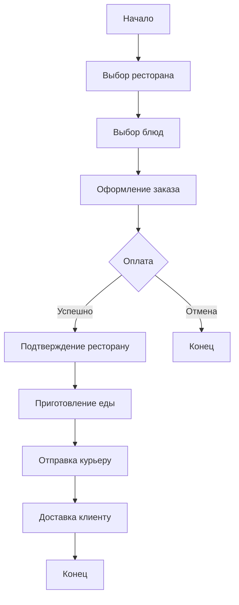
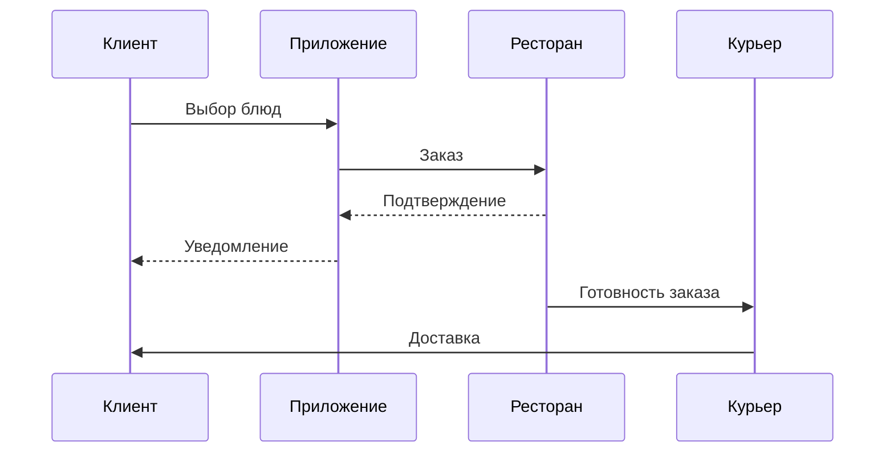
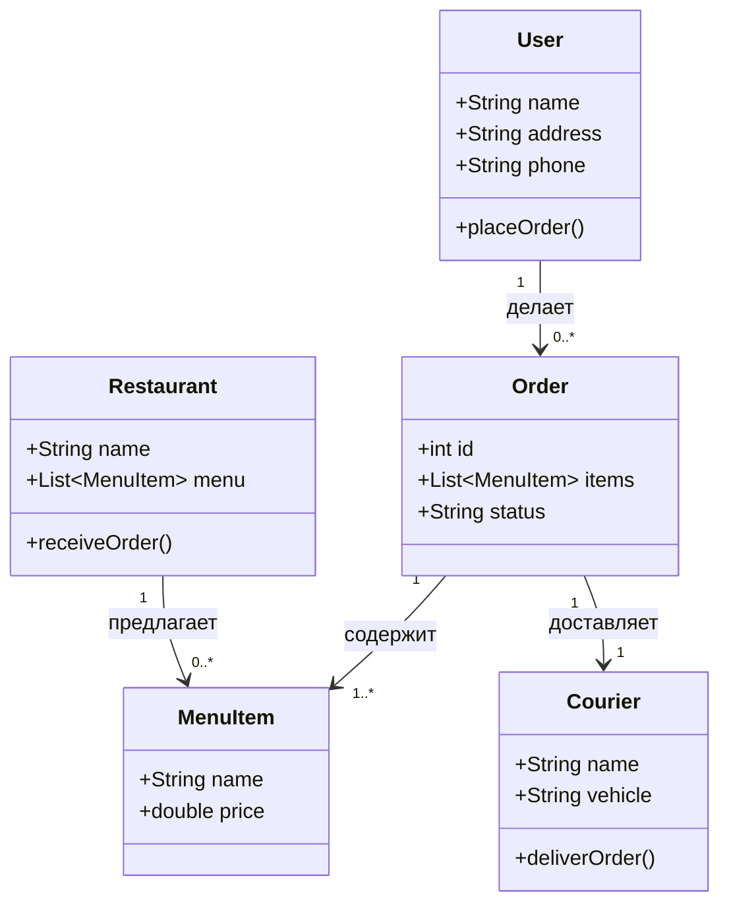
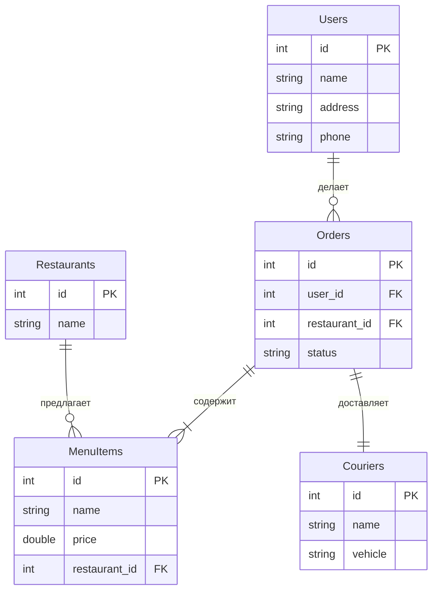
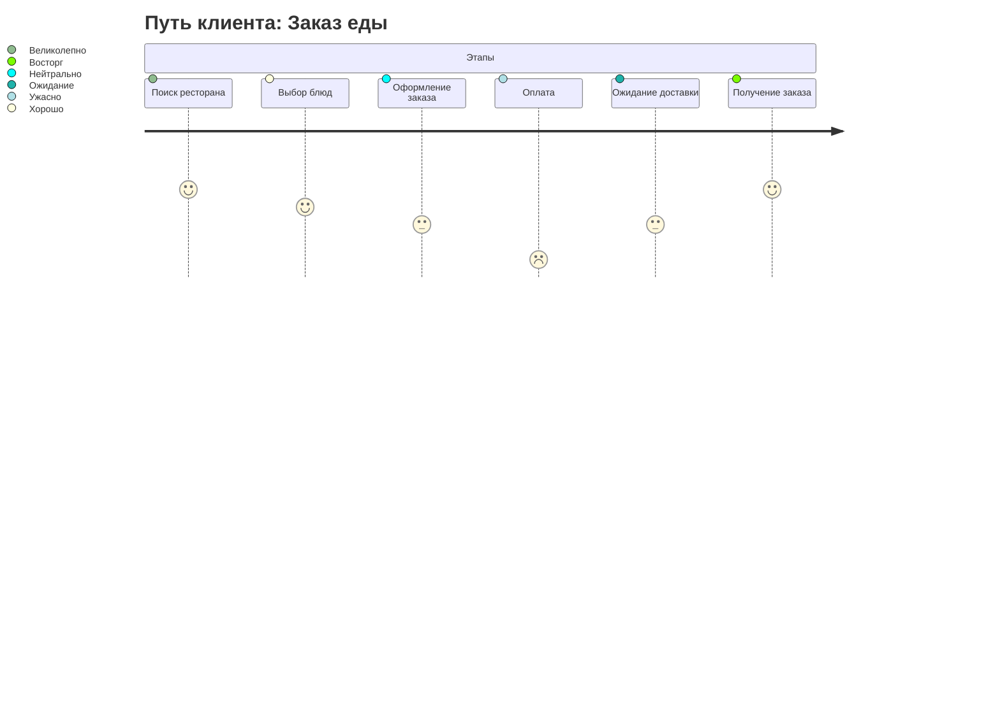
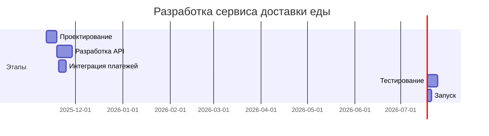

```mermaid
flowchart TD
    A[Начало] --> B[Выбор ресторана]
    B --> C[Выбор блюд]
    C --> D[Оформление заказа]
    D --> E{Оплата}
    E -->|Успешно| F[Подтверждение ресторану]
    E -->|Отмена| G[Конец]
    F --> H[Приготовление еды]
    H --> I[Отправка курьеру]
    I --> J[Доставка клиенту]
    J --> K[Конец]
```

```mermaid
sequenceDiagram
    participant Клиент
    participant Приложение
    participant Ресторан
    participant Курьер

    Клиент->>Приложение: Выбор блюд
    Приложение->>Ресторан: Заказ
    Ресторан-->>Приложение: Подтверждение
    Приложение-->>Клиент: Уведомление
    Ресторан->>Курьер: Готовность заказа
    Курьер->>Клиент: Доставка
```

```mermaid
classDiagram
    class User {
        +String name
        +String address
        +String phone
        +placeOrder()
    }

    class Restaurant {
        +String name
        +List~MenuItem~ menu
        +receiveOrder()
    }

    class Order {
        +int id
        +List~MenuItem~ items
        +String status
    }

    class Courier {
        +String name
        +String vehicle
        +deliverOrder()
    }

    class MenuItem {
        +String name
        +double price
    }

    User "1" --> "0..*" Order : делает
    Restaurant "1" --> "0..*" MenuItem : предлагает
    Order "1" --> "1..*" MenuItem : содержит
    Order "1" --> "1" Courier : доставляет
```

```mermaid
erDiagram
    Users ||--o{ Orders : "делает"
    Restaurants ||--o{ MenuItems : "предлагает"
    Orders ||--|{ MenuItems : "содержит"
    Orders ||--|| Couriers : "доставляет"

    Users {
        int id PK
        string name
        string address
        string phone
    }

    Restaurants {
        int id PK
        string name
    }

    MenuItems {
        int id PK
        string name
        double price
        int restaurant_id FK
    }

    Orders {
        int id PK
        int user_id FK
        int restaurant_id FK
        string status
    }

    Couriers {
        int id PK
        string name
        string vehicle
    }
```

```mermaid
journey
    title Путь клиента: Заказ еды
    section Этапы
      Поиск ресторана: 5: Великолепно
      Выбор блюд: 4: Хорошо
      Оформление заказа: 3: Нейтрально
      Оплата: 1: Ужасно
      Ожидание доставки: 3: Ожидание
      Получение заказа: 5: Восторг
```

```mermaid
gantt
    title Разработка сервиса доставки еды
    dateFormat  YYYY-MM-DD
    section Этапы
    Проектирование :a1, 2025-11-12, 7d
    Разработка API :after a1, 10d
    Интеграция платежей :2025-11-20, 5d
    Тестирование :after a2, 7d
    Запуск :after a3, 3d
```
