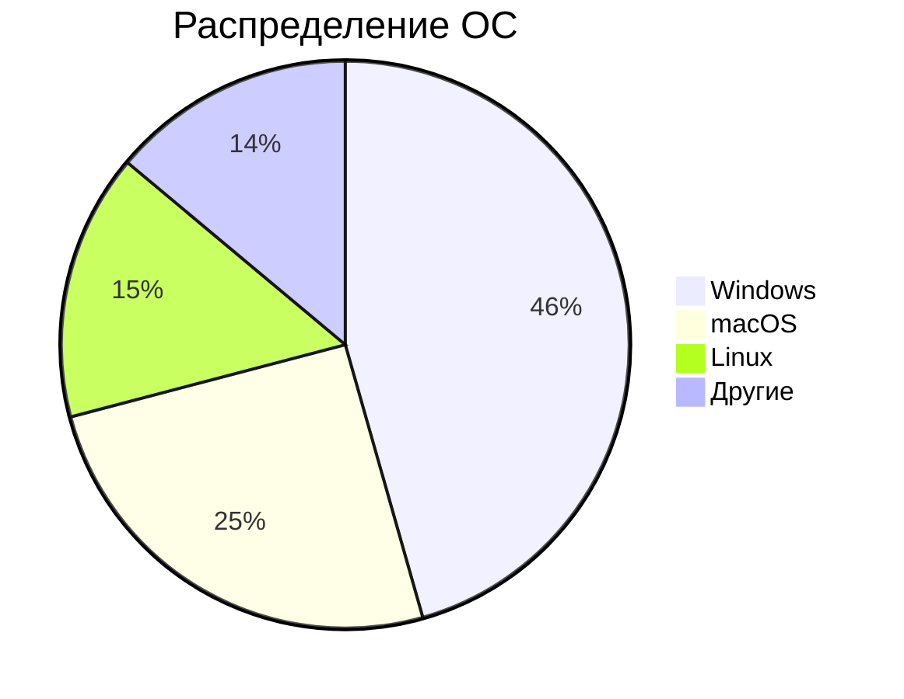
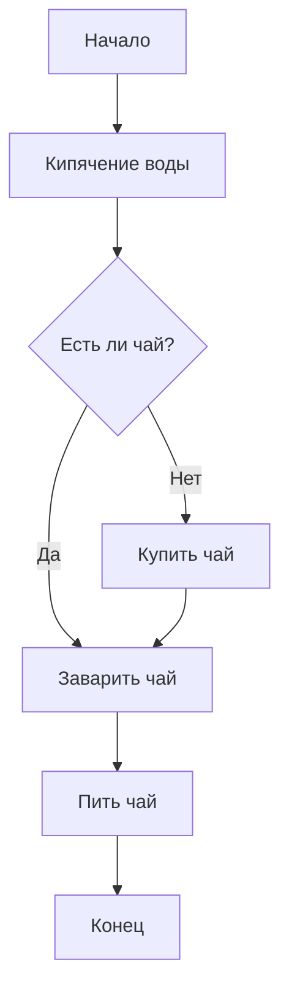
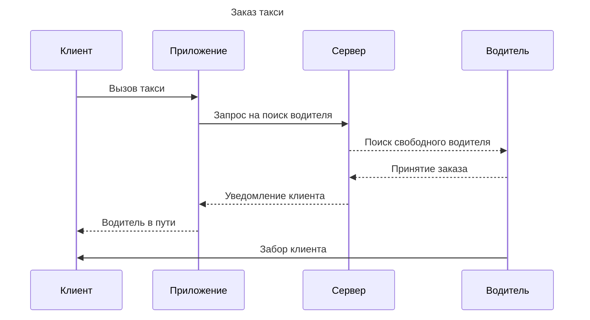
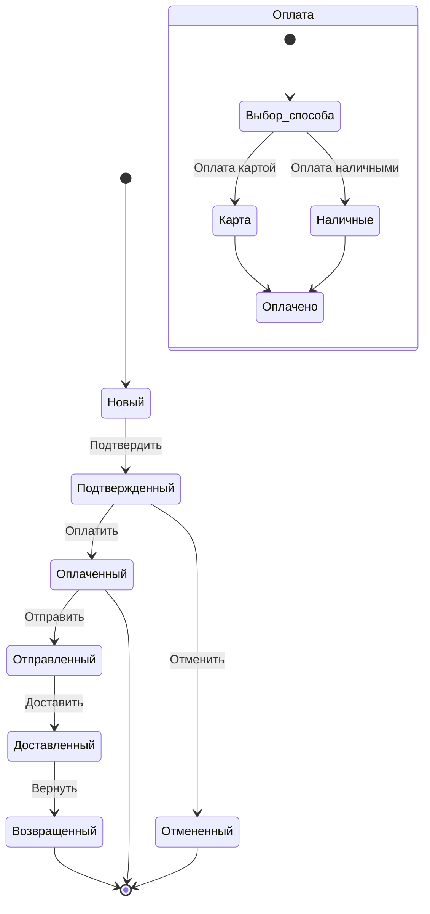
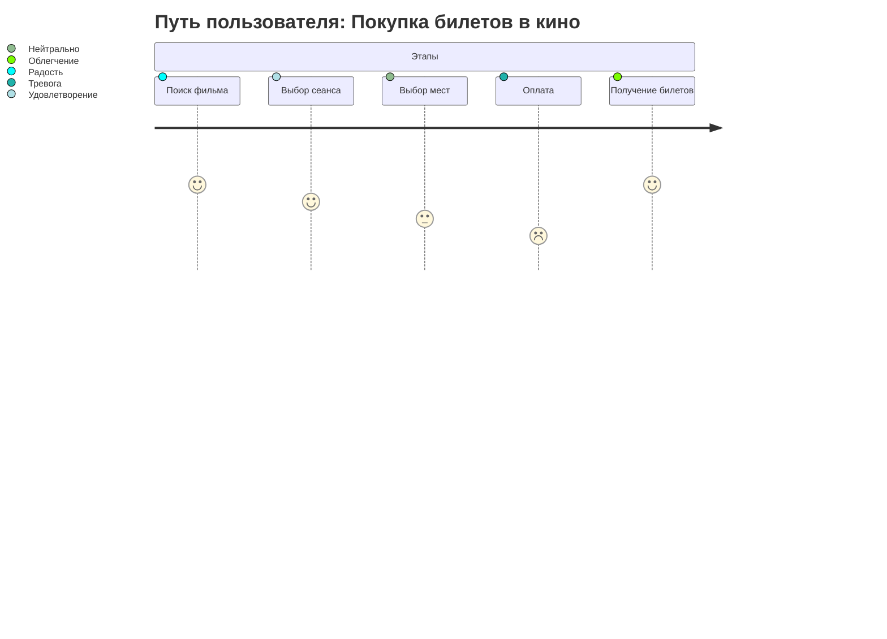
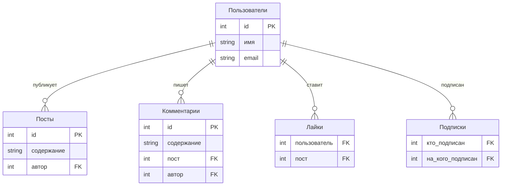

# egorMos12
markdown


задание 1.1


     ЗАДАНИЕ 1.2



   ЗАДАНИЕ 2.1
   ```mermaid
   classDiagram
    class Book {
        +String title
        +String author
        +String ISBN
        +Boolean isAvailable
    }

    class User {
        +String name
        +String userId
        +List~Book~ borrowedBooks
    }

    class Library {
        +List~Book~ books
        +List~User~ users
    }

    User "*" *-- "0..*" Book : берет
    Library "1" o-- "0..*" Book : содержит
    Library "1" o-- "0..*" User : регистрирует
```
 задание 2.2 
 ```mermaid
 gantt
    title Разработка мобильного приложения
    dateFormat  YYYY-MM-DD
    section Этапы
    Подготовка       :a1, 2025-11-12, 5d
    Дизайн           :after a1, 7d
    Фронтенд         :after a2, 10d
    Бэкенд           :2025-11-17, 12d
    Тестирование      :after a3, after a4, 5d
```
   
   ЗАДАНИЕ 3.1
   ```mermaid
   graph TD
    subgraph Frontend
        A[React] --> B[Redux]
        A --> C[Router]
    end

    subgraph Backend
        D[Node.js] --> E[Express]
        E --> F[MongoDB]
    end

    subgraph Внешние сервисы
        G[Stripe]
        H[SendGrid]
    end

    A -->|API| E
    E -->|Платежи| G
    E -->|Email| H
```

задание 3.2

     ЗАДАНИЕ 4.1

задание 4.2
